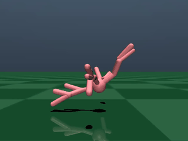
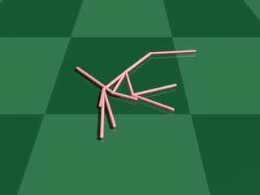
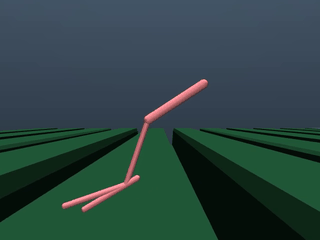
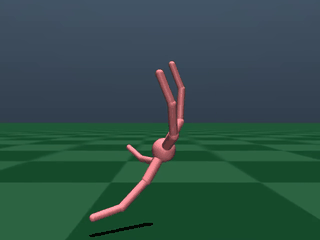
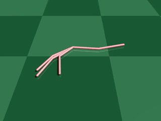
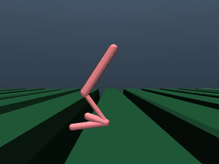

# MorphoGen

MorphoGen is an LLM-driven framework for robot morphology optimization that directly evolves MuJoCo XML genotypes. It integrates a powerful evolutionary coding agent (OpenEvolve) with a fast RL-based controller optimization stack (Transform2Act), enabling end-to-end design of robot bodies and controllers without restricting creativity to predefined graph edits.


| Method | Ant | Swimmer | Gap |
|-------|-----|-|-|
| T2A   |  |  |  |
| MorphoGen  |  |  |  |


## Introduction

The functionality of a robotic agent is fundamentally determined by its physical form, or morphology. In our setting, a robot’s morphology is encoded as a MuJoCo XML genotype specifying skeletons, joints, and attributes. Automating the search for optimal genotypes is compelling but challenging due to the massive combinatorial design space and the high cost of evaluating each candidate (which typically requires an inner loop of controller optimization).

Existing approaches sidestep direct XML generation by introducing graph abstractions and hand-crafted genetic operators (e.g., add/delete nodes/edges) or by learning policies over a fixed, limited set of graph edits with GNNs and RL. These methods constrain exploration and reduce expressiveness compared to the true XML design space.

Recent advances in large language models (LLMs) unlock direct generation and refinement of structured code. Inspired by this, MorphoGen treats robot XML genotypes as specialized code and reframes morphology design as code evolution. We replace hand-crafted genetic operators with an LLM that performs semantically rich mutation/crossover directly on XML, guided by a critic LLM that provides gradient-like textual feedback. To improve efficiency, we use structure pretraining for strong initial parents and a two-stage fast controller optimization to accelerate evaluation. MorphoGen thus explores the full expressiveness of XML-based designs while maintaining intelligent, efficient search.

## Repository Structure

- `openevolve/`: Evolutionary coding agent and examples, including morphology optimization examples using MuJoCo XML and RL evaluation.
- `Transform2Act/`: RL training/evaluation stack for MuJoCo control with predefined tasks and utilities.

## Requirements

- Python 3.9+
- MuJoCo 2.x installed on the system and accessible to `mujoco_py` (classic API used by `Transform2Act`).
  - Follow mujoco-py setup instructions (system packages, compiler toolchain, GLFW) and ensure `MUJOCO_PY_MUJOCO_PATH` or default MuJoCo install path is set.
- LLM access via an OpenAI-compatible API for OpenEvolve
  - Set `OPENAI_API_KEY` or configure `llm.api_base` in configs to use other providers.

### Python Dependencies

Install OpenEvolve (editable) and example/visualizer deps:

```bash
pip install -e .
pip install -r scripts/requirements.txt
```

Install Transform2Act dependencies (uses mujoco-py and gym 0.15):

```bash
pip install -r requirements.txt
```

Note: `Transform2Act` relies on `mujoco_py` and older `gym`. Ensure your environment is compatible (e.g., separate virtualenv/conda env recommended).

## Quick Start: Morphology Optimization with RL Controller

We provide ready-to-run examples that evolve MuJoCo XML robot designs while using RL-based controllers for evaluation. Below is the Swimmer example; similar scripts exist for Hopper, Ant, and Gap.

### 1) Set LLM credentials

```bash
export OPENAI_API_KEY=your_api_key
```

Optionally, point to another provider via `config.yaml` (`llm.api_base`).

### 2) Run an example (Swimmer)

Use the provided helper script which orchestrates OpenEvolve and evaluation:

```bash
bash openevolve/examples/design_opt_rl_swimmer/swimmer.sh
```

This will:
- Start from `openevolve/examples/design_opt_rl_swimmer/init_xml/best.xml`
- Run the evolution loop using `openevolve/openevolve-run.py`
- Write results to `openevolve/examples/design_opt_rl_swimmer/result/swimmer_new`

Command-line options:

```bash
# Resume from a checkpoint (relative or absolute)
bash openevolve/examples/design_opt_rl_swimmer/swimmer.sh \
  --checkpoint openevolve/examples/design_opt_rl_swimmer/result/swimmer_new/checkpoints/checkpoint_5

# Limit iterations and set a target score
bash openevolve/examples/design_opt_rl_swimmer/swimmer.sh \
  --iterations 10 --target-score 0.9

# Extract top N non-seed XMLs from latest checkpoint
bash openevolve/examples/design_opt_rl_swimmer/swimmer.sh --extract-top 3
```

### 3) Visualize evolution (optional)

```bash
python scripts/visualizer.py --path \
  examples/design_opt_rl_swimmer/result/swimmer_new/checkpoints/checkpoint_100/
```

## Running Other Tasks

We include similar setups for Hopper, Ant, and Gap:
- `openevolve/examples/design_opt_rl_hopper/hopper.sh`
- `openevolve/examples/design_opt_rl_ant/ant.sh`
- `openevolve/examples/design_opt_rl_gap/gap.sh`

Each has its own `config.yaml`, `evaluator.py`, and `init_xml/` seed designs. You can also run via the generic CLI:

```bash
python openevolve-run.py \
  ../openevolve/examples/design_opt_rl_swimmer/init_xml/best.xml \
  ../openevolve/examples/design_opt_rl_swimmer/evaluator.py \
  --config ../openevolve/examples/design_opt_rl_swimmer/config.yaml \
  --iterations 100
```


